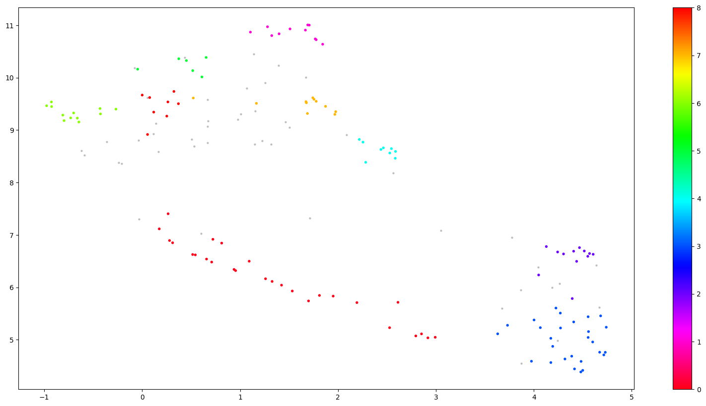

# Topic Modelling Users' Feedbacks

This project is designed to apply Natural Language Processing (NLP) techniques to analyze a small dataset named "issues.csv" containing user feedbacks about a streaming service that offers a wide variety of movies and TV shows. The primary objective is to use clustering algorithms to group similar feedbacks together, making it easier to identify and prioritize issues that need to be addressed.
The current project include the implementations for both the BERT and NMF clustering methods for the topic modeling process. Specifically:

- BERT Clustering:
  - Utilizes the SentenceTransformer package to encode text data using the - BERT model.
  - Applies UMAP for dimensionality reduction.
  - Utilizes HDBSCAN for clustering, considering parameters such as minimum cluster size and metric. It automatically detects noise in the data (-1 as cluster id).
  - Calculates the c-TF-IDF matrix to identify top words per topic.
- NMF Clustering:
  - Utilizes the TfidfVectorizer for text vectorization.
  - Applies KMeans for clustering, determining the best number of clusters based on silhouette scores.
  - Uses Non-Negative Matrix Factorization for identifying keywords for each topic.
  - These methods demonstrate a comprehensive approach to topic modeling, leveraging both the strengths of deep learning embeddings (BERT) and traditional NLP techniques (NMF).

## Table of Contents

- [Introduction](#introduction)
- [Problem Statement](#problem-statement)
- [Project Structure](#project-structure)
- [Getting Started](#getting-started)
  - [Prerequisites](#prerequisites)
  - [Installation](#installation)
- [Usage](#usage)
- [Improvements](#improvements)

## Project Structure

```
project-root/
│
├── app/
│ ├── api.py
│ └── Dockerfile
│ └── requirements.txt
│
├── data/
│ ├── input/
│ │ └── issues.csv
│ └── output/
│
├── modules/
│ ├── preprocessing.py
│ └── clustering.py
│
├── requirements.txt
│
└── README.md
```

## Getting Started

### Prerequisites

- Python 3.10.2
- Docker

### Installation

1. Clone this repository to your local machine.
2. Build the Docker image and start the service: `docker compose up --build`
3. Wait until the message `Running on http://127.0.0.1:5000` appears in your terminal.
4. Send an API request
5. Execute the command `docker exec -it <name of the running container> bash` into another terminal and navigate to `~/data/output/` to find the results.

## Usage

To use the API, you can use a tool like Postman.

Example API request:
`http://127.0.0.1:5000/topic_modeling?input_df_path=./data/input/issues.csv&model_name=bert`

- `input_df_path`: Path to the input CSV file.
- `model_name`: Choose between "bert" (default) or "nmf" for topic modeling.

## Results

Preliminary results suggest that the BERT-based approach may offer better performance, capturing semantic meaning and handling various text data effectively. However, further analysis is required to confirm these observations and delve deeper into the quality of clusters.

Future analyses should encompass:
- **Semantic Coherence:** Evaluating the coherence of topics generated by BERT to ensure they align with the expected semantic context.
- **Cluster Validation:** Employing techniques like silhouette score or Davies-Bouldin index to quantitatively assess the quality of clusters.
- **Domain-specific Evaluation:** Tailoring the analysis to specific domain requirements, such as industry-specific jargon or context.

## Pros and Cons
### BERT-based Clustering

- Advantages:
  - Utilizes pre-trained BERT embeddings, which capture semantic meaning in the text.
  - Effective in handling a wide range of text data, including long and short documents.
  - Can discover complex and nuanced relationships between documents.
- Disadvantages:
  - Requires substantial computational resources, especially for large datasets.
  - Limited interpretability of clusters due to the black-box nature of deep learning models.
  - May not perform well on very specific or niche datasets with unique vocabulary.

### NMF-based Clustering

- Advantages:
  - Provides interpretable topics as the cluster descriptions are based on top keywords.
  - Computationally less intensive compared to deep learning models.
  - Performs well on datasets with distinct and well-defined topics.
- Disadvantages:
  - Relies on term frequency-inverse document frequency (TF-IDF) vectorization, which may not capture semantic meaning as effectively as word embeddings.
  - Less suitable for handling very long documents, as the TF-IDF approach can lead to high dimensionality.
  - The quality of clustering heavily depends on the choice of parameters, such as the number of topics.

BERT-based clustering may be preferred when accuracy and capturing semantic meaning are paramount, while NMF-based clustering may be more suitable when interpretability and simplicity are essential.

## Improvements

Share any ideas for future improvements or features you plan to add to your project.
1. Algorithm Selection: Evaluate and experiment with various topic modeling algorithms such as Latent Dirichlet Allocation (LDA), Latent Semantic Analysis (LSA), or Hierarchical Dirichlet Process (HDP) to identify the most suitable one for the dataset.
2. Hyperparameter Tuning: Conduct extensive hyperparameter tuning for the selected topic modeling algorithm to improve topic quality.
3. Optimal Number of Topics: Implement techniques for automatically determining the optimal number of topics, such as coherence scores, topic coherence, or grid search.
4. Custom Stopwords: Allow users to specify custom stopwords relevant to their domain or dataset to improve the quality of topics.
5. Advanced Preprocessing: Enhance text preprocessing techniques, including lemmatization, stemming, and handling special characters, to improve topic modeling quality.

## Plots
Additional plots can be found in the "plots" directory.

In the plots below, all the feedbacks stored in the dataset are represented with reduced dimensionality (2 dimensions only) and colored by topic. Grey points represent noise (-1 as cluster id).


